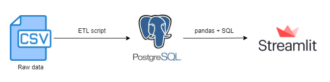

# Hoolieats

Hoolieats consumers order food from restaurants, and they do it through the Hooli Chat application: an application that is similar to Whatsapp. There is a bunch of CSV files that we would like to perform some analysis on, to answer some business questions for our sales department. Primarily, the sales team wants to know more about our consumers and how they rate our restaurants.

## Pre-requisites

1. Docker
2. docker-compose
3. Port 8501 and 5433 available

## Steps

1. docker-compose up -d --build
2. docker exec hoolieats-st python /app/etl/etl.py
3. Visit localhost:8501 to access the Streamlit app

## Project structure

The source code for the project is stored in the `src` directory. There are a few directories:

- `config`: defines the location of the csv files and the parameters to connect to the Postgres database
- `etl`: contains the code the perform ETL process on the csv files
- `pages`: contains the source code of the streamlit pages
- `sql`: contains sql queries for the project
- `utils`: contains the source code of some utility functions

## High-Level Overview

An ETL script is executed to extract, transform and load the raw data from the csv files to a Postgres database. The streamlit application dashboards are populated with data in Postgres queried using pandas and SQL.

## Optional 

Connect to the Postgres database from host machine using:
- POSTGRES_HOST=localhost
- POSTGRES_PORT=5433
- POSTGRES_PASSWORD=password
- POSTGRES_USER=hoolieats
- POSTGRES_DATABASE=hoolieats
